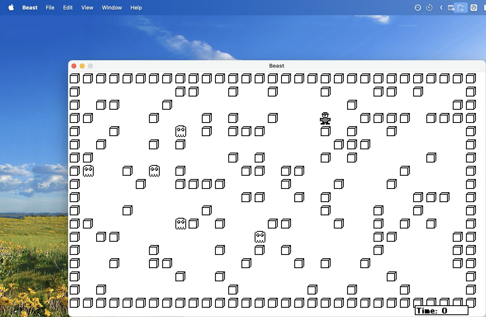

# Beast 1.0 — reverse-engineering notes



*Beast 1.0* (Chuck Shotton / BIAP Systems, 3 March 1989) is a shareware Mac game written in
Lightspeed Pascal. This directory holds the original files plus a full decompilation.

> **Copyright.** Beast 1.0, including its code, artwork and text, is © 1989 Chuck Shotton and BIAP
> Systems. The original application, its instructions, the resources extracted from it, and the
> decompiled and disassembled code are included for preservation and study. This project isn't
> affiliated with or endorsed by the author. If you hold rights to Beast and want anything removed,
> please open an issue. The Swift port and the tools are © 2026 Roy Tinker.
>
> The Swift port in `port/` is released under the [MIT License](port/LICENSE). Two files in it are
> derived from the original and are **not** covered by that license: `port/Sources/Beast/Artwork.swift`
> (the original pictures) and `port/Resources/AppIcon.icns` (the original icon).

| Path | What |
|---|---|
| `Beast 1.0` | original application (all content is in the **resource fork**; data fork is empty). Not in git |
| `original/Beast 1.0.rsrc` | that resource fork saved as a plain file, so git keeps it (type `APPL`, creator `BPbs`) |
| `Beast Instructions.text` | original docs (Mac Roman, CR line endings) |
| **`src/Beast.p`** | **reconstructed Pascal source of the game (CODE 2)** |
| **`src/BeastSettings.p`** | **reconstructed Pascal source of the settings unit (CODE 1, tail)** |
| `disasm/CODE_1.s`, `disasm/CODE_2.s` | annotated 68000 disassembly (traps, globals, jump table, strings) |
| `disasm/jumptable.txt` | A5 jump table |
| `resources/Beast.r` | DeRez dump of every resource |
| `resources/PICT_*.png` | sprites and dialog art; `PICT_dump.txt` has the text inside the Help/Info pictures |
| `tools/` | resource-fork parser, trap table, disassembler, PICT decoder, `extract.sh`, `gen_artwork.py` |
| **`port/`** | **the Swift/AppKit port for modern macOS** (see below) |

To regenerate `disasm/` and `resources/`, run `pip install -r tools/requirements.txt && tools/extract.sh` on macOS.

The binary still had its **MacsBug symbols**: THINK Pascal wrote each procedure name, truncated to 8
characters, after its `RTS`. So every routine name in `src/` is the original. Local variable names are
invented. Each routine in the Pascal is annotated with its code offset, so you can check it against the
disassembly line by line.

## Binary layout

| Resource | Size | Contents |
|---|---|---|
| CODE 0 | 208 | jump table (23 entries); entry → `CODE 2 +$1048` |
| CODE 1 | 7290 | `$0000-$1801` THINK Pascal runtime library; `$1802-$1C79` settings unit |
| CODE 2 | 4226 | the game (27 procedures + main program) |
| LSP 2000 | 18 | Lightspeed Pascal marker |

These are the runtime-library entry points the game calls. The rest of CODE 1 is library code and
doesn't need to be ported.

| CODE 1 | Name | Purpose |
|---|---|---|
| `$0000` | RT_Concat | `Concat()` |
| `$0048` | RT_Halt | exit proc, then `ExitToShell` |
| `$0054/$009C/$00B2` | start-up | globals, SANE, Toolbox init, `MoreMasters` ×10 |
| `$0DCE` + `$0E1A` | set ops | load set constant, `in` test |
| `$0E52 … $0EA8` | writeln | text output to `Output` (the debug messages in the settings unit) |
| `$15CC` | NGetTrapAddress | |
| `$15F8` | PBSetVol | |
| `$1672 / $1686` | StringToNum / NumToString | Pack7 |
| `$1698` | SysEnvirons | glue |

## Data model (A5 globals)

| A5 offset | Pascal | Notes |
|---|---|---|
| `-$3F8` | `gBoard: packed array[1..31, 1..18] of 0..3` | one byte/cell, address = `A5-$40B + x*18 + y` |
| `-$408` | `gPics: array[0..3] of PicHandle` | indexed by cell value |
| `-$40C` | `gMan: Point` | `h` = x, `v` = y |
| `-$434` | `gBeasts: array[1..10] of Point` | |
| `-$43C` | `gTimers: array[0..1] of LongInt` | next tick: 0 = beasts, 1 = clock |
| `-$43E` | `gClock: Integer` | seconds |
| `-$43F/-$440` | `gPlaying`, `gPaused` | |
| `-$442/-$444/-$446` | `gBeastDelay`, `gNumBeasts`, `gDensity` | live copies of settings |
| `-$452` | `gSettings: record numBeasts, delay, density: LongInt end` | persisted |
| `-$10E` | `gWindow` | |
| `-$1BE` | `gEvent: EventRecord` | |
| `-$34` | `thePort` | QuickDraw globals below it (`randSeed` = `-$B2`) |

The cell values are also the PICT index:

| Value | Meaning | PICT |
|---|---|---|
| 0 | man | 200 |
| 1 | block | 201 |
| 2 | beast | 202 |
| 3 | empty | not drawn, just erased |

## Game rules, as the code actually implements them

- **Board.** 31×18 cells of 16 px, drawn into WIND 128 (506×297, title "Beast"). The outer ring
  (x = 1 or 31, y = 1 or 18) is solid blocks. In practice it can't be moved.
- **New game** (`File > New Game`, ⌘N):
  - Place `558 div density` blocks at random empty interior cells.
  - Place the beasts, then the man, at random interior cells that aren't already a beast. They can land
    on a block and replace it.
  - The game starts **paused** and begins on the first key press or click.
- **Man.** Moved with I/J/K/L (up/left/down/right, either case). Other keys beep (`SysBeep(2)`).
  Moving into:
  - **empty:** step.
  - **beast:** "Dead Meat !!!" and the game ends.
  - **block:** push. The whole run of blocks slides one cell if the cell after the run is empty. A beast
    or the board edge stops the push. Beasts are never crushed.
- **Beasts.** Every `gBeastDelay` ticks, each beast that has an empty cell or the man among its 8
  neighbours steps one cell toward the man, diagonals included. It aims with `sign(dx), sign(dy)`.
  - Target is the man: "Dead Meat!!!" and the game ends.
  - Target is empty: it moves.
  - Target is a block: it tries one random direction in −1..1 × −1..1 and moves only if that cell is
    empty.
  - Target is another beast: it waits.
- **Win.** When **no** beast has an open neighbour: "You Win!!!". Trapped beasts don't move.
- **Clock.** "Time: n" goes up once a second in a framed box at (420,283)–(485,295), 9-pt bold. The box
  overlaps the bottom wall row.
- **Pause.** `File > Pause` (⌘P). Any key or click resumes.
- **Background.** Beasts keep moving while the app is in the background under MultiFinder.
  `WaitNextEvent` sleeps 20 ticks there instead of 0.
- **Settings** (DLOG 129; `File > Settings…`, ⌘S):

  | Setting | Range | Default |
  |---|---|---|
  | beasts | 1–10 | 5 |
  | delay (ticks) | 1–360 | 45 |
  | density | 2–10 | 5 |

  They are clamped on OK and saved to resource `BSet` 128 in `System Folder:Beast Game Settings`.
  They apply **immediately**. Raising the beast count mid-game makes `DoMoveBeasts` process array
  slots that were never placed on this board: stale positions from an earlier game, or (0,0). That is
  the "interesting results" the manual mentions.
- **About** (ALRT 128) has *Help!* (ALRT 130 / PICT 130) and *Info* (ALRT 131 / PICT 131) buttons. The
  help and info text is drawn inside the PICTs.
- **Edit menu.** Only for desk accessories. On the game window it shows "Edit commands are currently for
  DAs only."
- **Messages.** Win, lose and error messages all use ALRT 129 via `Error(msg)`.

## Quirks and bugs in the original (kept in the decompiled source)

1. `DoMulti` beeps on a `mouseMovedMessage` app4Evt. This looks like leftover debug code.
2. `DoMulti` treats every app4Evt as suspend/resume based only on bit 0.
3. `SaveBeastSettings` calls `ReleaseResource` after `CloseResFile` has already freed the handle.
4. `RandomMatrix` can put a beast or the man on top of a block.
5. `OpenSpace` has no bounds check. This is safe only because beasts can never reach the border ring.
6. `DoMoveBeasts` computes a random `dx/dy` and then overwrites it straight away.
7. `PushBlock` computes a "horizontal" flag it never uses.
8. The settings routines report problems with `writeln`, which would open THINK's console window.
9. `Init` repeats the Toolbox initialisation the runtime start-up already did.

## Porting notes (for step 2)

- The whole game is about 700 lines of logic with no dependencies beyond QuickDraw, the Event Manager
  and the Resource Manager. It maps directly onto a single `NSView` with a 16-px grid.
- Timing is in ticks (1/60 s). `CheckTime` is polled from the event loop, so a 60 Hz timer or
  `CADisplayLink` reproduces it exactly.
- Sprites: `resources/PICT_200/201/202.png` (1-bit, 16×16).
- The About picture is `PICT_128.png`: a hand-drawn stick figure outside a house. The Help and Info
  PICTs are mostly text: see `resources/PICT_dump.txt`.
- The settings file can become `UserDefaults` with the same three keys and clamps.
- `Random` is QuickDraw's Park–Miller generator (`randSeed := randSeed * 16807 mod (2^31 − 1)`, low 16 bits
  returned as a signed Integer). It is seeded from `TickCount` at each new game. Reproduce it if you want
  identical board-generation behaviour.

## The Swift/AppKit port (`port/`)

A native macOS 14+ app. It's a universal binary for Apple silicon and Intel.

```sh
cd port
swift test               # game-logic tests
./build-app.sh           # builds and ad-hoc signs port/build/Beast.app
open build/Beast.app
```

| Path | What |
|---|---|
| `Sources/BeastCore/BeastGame.swift` | the game. It translates `src/Beast.p` routine by routine, and each method names its original |
| `Sources/BeastCore/BeastSettings.swift` | the settings and their limits ([VERIFYSE]), plus `StringToNum` |
| `Sources/BeastCore/QDRandom.swift` | QuickDraw's `Random` |
| `Sources/Beast/` | the AppKit shell: window, menus, dialogs, drawing, settings storage |
| `Sources/Beast/PICT.swift` | a small QuickDraw PICT interpreter, so all artwork is drawn from the original data |
| `Sources/Beast/Artwork.swift` | the original PICT bytes, generated by `tools/gen_artwork.py` |
| `Resources/AppIcon.icns` | the app icon, scaled up from the original `ICN#` |
| `Tests/BeastCoreTests/` | tests for every rule in *Game rules* above |

`Beast --snapshot <dir>` writes PNGs of the game window (at 1x and 2x) and every dialog, then quits. It's there for
checking the drawing without clicking through the app.

The game logic keeps the original's behaviour, quirks included. The app shell follows the original
too:
- The window is the same size and title.
- The dialogs use the original item rectangles and artwork.
- Clicks and key presses resume a paused game.
- Beasts keep moving while the app is in the background.
- The game freezes while a menu or dialog is open.

### Deliberate differences from the original

1. **Menus.** Quit is in the app menu, and File gains Close. There are also standard Window and Help
   menus; Help › How to Play Beast opens the original Help screen. The Apple menu's desk accessories
   are gone.
2. **Edit menu.** It works in the Settings text fields. On the game window it shows the original
   "Edit commands are currently for DAs only." alert.
3. **Settings storage.** Settings live in `UserDefaults` rather than a file in the System Folder.
   Values are also clamped when loaded, so a hand-edited density of 0 can't divide by zero.
4. **Off-board reads.** Reading outside the board returns a block. In the original, raising the
   beast count mid-game let unplaced beasts read memory next to the board. Here they just stay put.
5. **Background events.** The MultiFinder handler (`DoMulti`) has no macOS equivalent, so its debug
   beep and its 20-tick background sleep are gone. The game still runs in the background.
6. **Look.** Dialogs have title bars and modern controls, placed at the original positions. In the
   dialogs, Chicago is replaced by the system font; Geneva is still Geneva. The clock uses a small
   bitmap font (`ClockFont.swift`) in the style of the era, made bold the way QuickDraw did it.
7. **Arrow keys.** They move the man as well as I/J/K/L, and like any key they resume a paused game.
   The original beeped at them.
8. **Zoom.** View › Actual Size (⌘1) and Double Size (⌘2) zoom the game window, and the choice is
   remembered. Double Size is the default, unless the screen is too small for it. At 2x every original pixel becomes a sharp 2x2 block: nothing is smoothed or blurred.
9. **Random numbers.** `QDRandom` follows QuickDraw's documented algorithm but hasn't been checked
   against a real Mac. Boards are random either way, because the seed comes from the clock.
